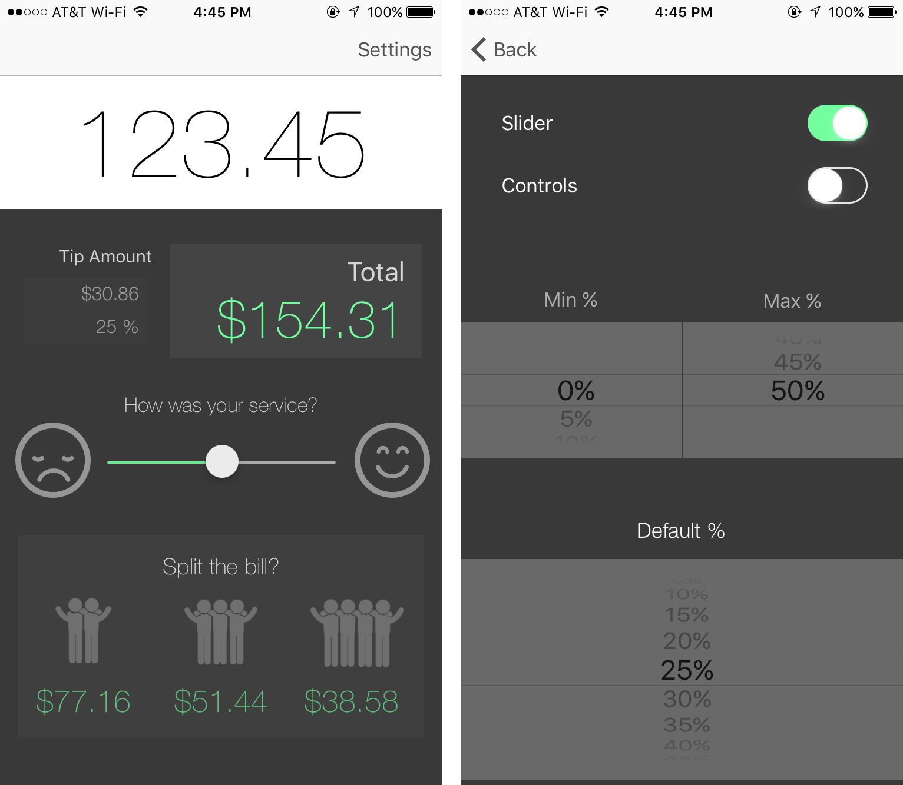
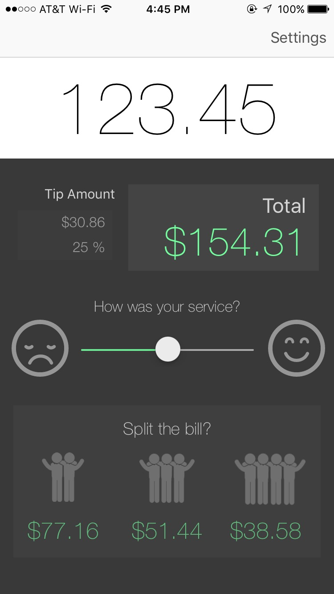
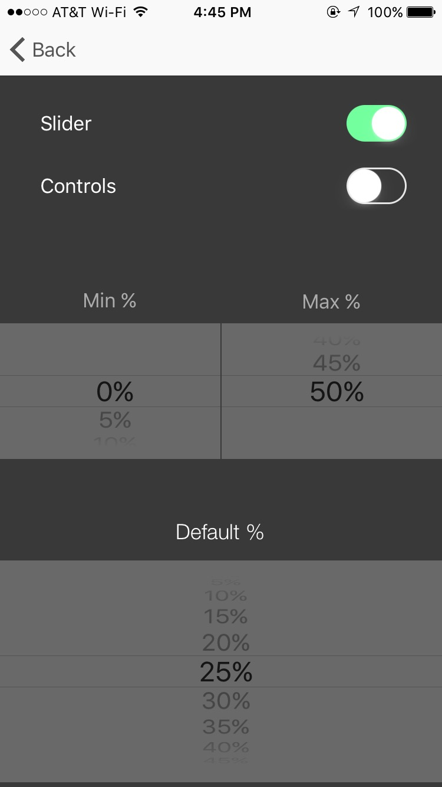

# tips
#### built for 2016 CodePath Pre-work

tips is a iOS application that calculates tip based on input bill amount and tip percentage, inputed by either segmented control or slider control

## Table of Contents
* [Features](#features)
* [Video Walthrough](#video)
* [Screens](#screens)
* [Submission Checklist](#checklist)

---

## **Features**
* **Ability to choose between 2 kinds of percentage input**
  1. ***Slider***
    * *Can set defaults:*
      * Minimum value of slider
      * Maximum value of slider
      * Default value of slider
  2. ***Segmented Controls***
    * Set to 18, 20, & 22
* **Split the bill**
  *  Split between parties of 2, 3, 4
* **International Formatting (Region Based)**
* **Loading Screen Animation**
* **Animation upon inputting text**

---

## **Video Walkthrough**

### HD walkthrough available [on YouTube](https://youtu.be/PGZw1ge-9TI_)

---

## **Screens**

#### Main Screen

#### Settings Screen

---

## **CodePath Submission Checklist**
This application was made as prework for admission to CodePath, description for which are [found here](http://courses.codepath.com/snippets/intro_to_ios/prework_university.md)

#### Following is the submission checklist
> Please review the following checklist to ensure your submission is valid:

>> 1. Did you implement both the TipViewController and the SettingsViewController?
2. Did you successfully push your code to github? Can you see the code on github?
3. Did you add a README which includes a GIF walkthrough of the app's functionality?
4. Did you create an issue on the repo and include /cc @codepathreview in the issue body?

#### CheckList
|  | Requirement | Done? |
|---|-------------|-------|
| 1 | TipViewController | YES |
| 1 | SettingsViewController | YES |
| 2 | Pushed to GitHub | YES |
| 3 | Added README | YES |
| 4 | Create Issue | NO |
